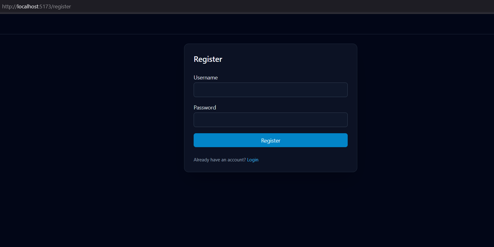
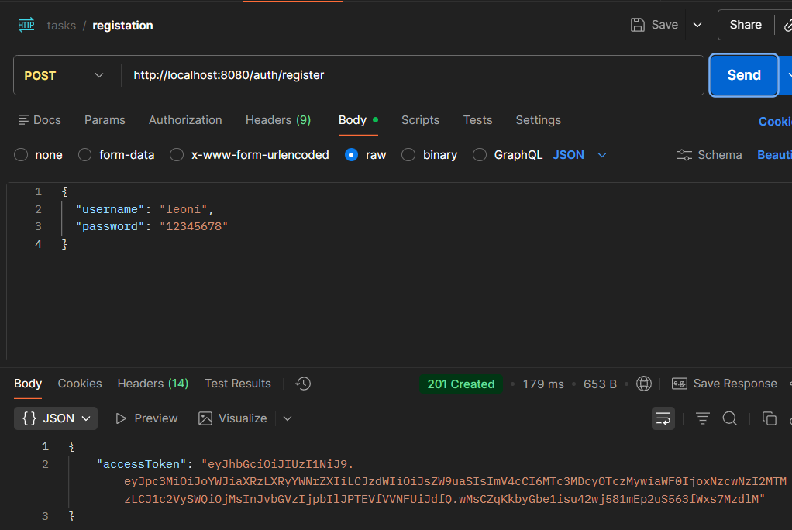
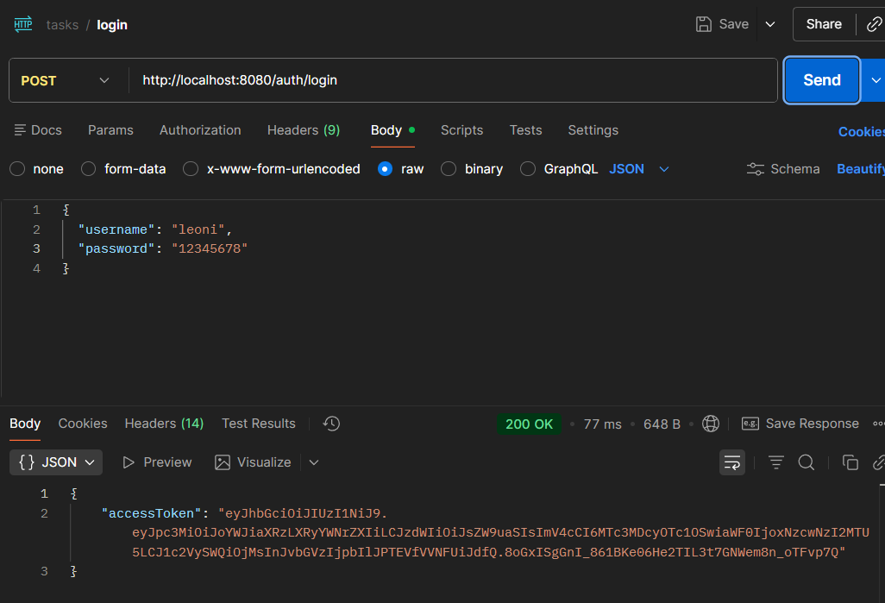
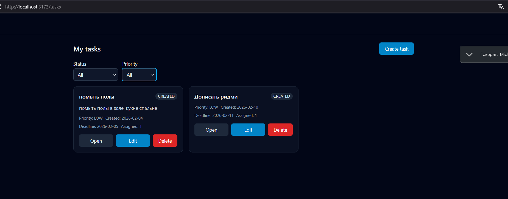
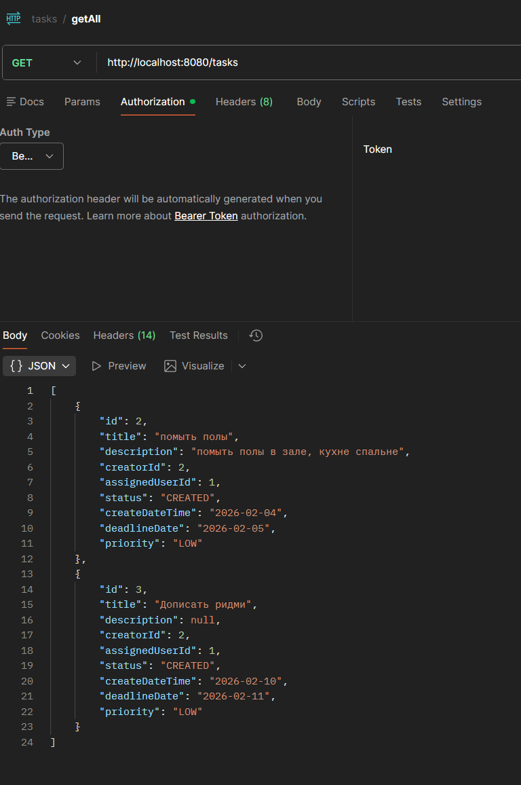
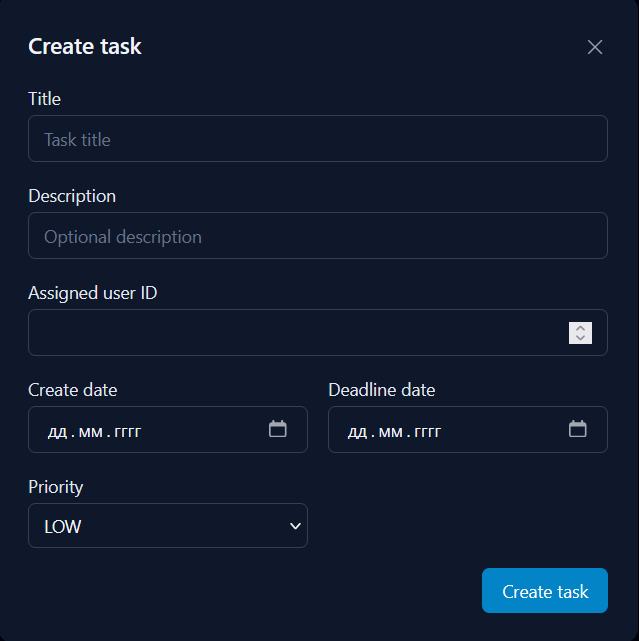
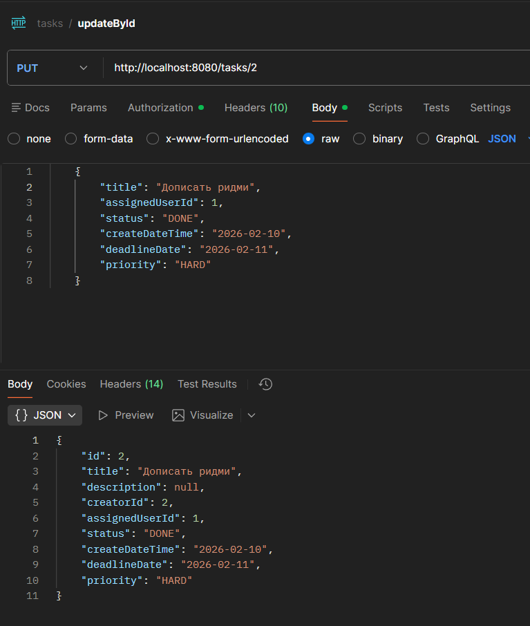

# TaskTracker — Fullstack App

TaskTracker — full-stack приложение для управления задачами с JWT-аутентификацией и role-based доступом (USER / ADMIN).

- **Backend:** REST API (порт **8080**)
- **Frontend:** React + TypeScript SPA (порт **5173**)
- **Auth:** JWT Bearer token, защищённые роуты и права по ролям
---

## Возможности

### Аутентификация и роли
- Регистрация и логин через JWT:
    - `POST /auth/register`
    - 
    - 
  
    - `POST /auth/login`
    - 
    - 
- Токен хранится на фронте и автоматически подставляется в запросы.
- Роли в токене: `ROLE_USER`, `ROLE_ADMIN`
    - обычные пользователи работают со своими задачами
    - админ видит общую таблицу задач

### Задачи
- Просмотр списка своих задач 
  - `GET /tasks`
  - 
  - 
- Фильтрация по **status** и **priority**
- Создание задачи через форму
  - 
- Просмотр деталей задачи
- Редактирование задачи
  - `UPDATE /tasks/task_id`
  - 
  - 
- Удаление задачами

### Admin зона
- `/admin/tasks` — доступ только для `ROLE_ADMIN`
- Read-only просмотр всех задач в таблице

---

## Tech Stack

### Frontend
- Cursor

### Backend (REST API)
- Java 25 + Maven + Spring Boot 3.5.9 + PostgresSQL
- REST эндпоинты под фронт: `/auth/**`, `/tasks/**`, `/admin/**`

---

## 1) Запуск Backend - порт 8080

Из корня репозитория:

```bash
./mvnw spring-boot:run
```

---
## 2) Запуск Frontend - порт 5173
```bash
cd frontend
npm install
cp .env.example .env
npm run dev
```
